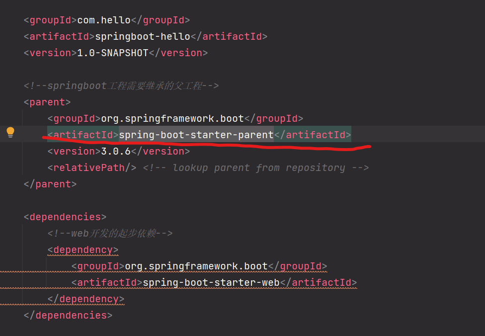

# MySpringBoot

# 1.概述

## 1-1-spring boot概述

### spring的缺点：
* 1、配置繁琐
> 搭建ssm项目，需要配置大量xml。application.xml  spring-mybatis.xml  spring-mvc.xml
> 大量的bean。
* 2、依赖繁琐
> pom.xml要写大量依赖。pom.xml spring-core  spring-bean  spring-mvc  spring-mybatis
> 版本冲突spring-core 4.0 spring-mvc 5.0

### springboot概念
springboot提供了一种快速使用spring的方式，基于**约定优与配置**的思想，可以让开发人员不必在配置上
与逻辑业务之间进行思维的切换，全身心的投入到逻辑业务的代码编写中，从而大大提高了开发的效率。
这是官网地址[springboot](https://spring.io/projects/spring-boot)


### springboot功能
* 1、自动配置   
springboot的自动配置是一个允许时（更准确地说，是应用程序启动时）的过程，考虑了众多因数，才决定
spring配置应该用哪个，不该用哪个。该过程是springboot自动完成的

* 2、起步依赖   
起步依赖本质上是一个Maven项目对象模型（Project Object Model POM），定义了对其他库的
**传递依赖**，这些东西加在一起即支持某项功能。**依赖太多**，**版本冲突**。

简单的说，起步依赖就是将具备某种功能的坐标打包到一起，并提供一些默认的功能。
* 3、辅助功能    
提供了一些大项目中常见的非功能性特性：如嵌入式服务器（tomcat）、安全、指标、健康检测、外部配置等。

**注意：SpringBoot并不是对Spring功能上的增强，而是提供了一种快速使用Spring的方式。**

## 1-2-springboot快速入门
官网：https://spring.io/projects/spring-boot
1、完成搭建springboot工程，定义HellController.hello()方法，返回“Hello SpringBoot”。

2、实现步骤：

1: 创建Maven项目springboot-hello    
2：导入springboot起步依赖      
```xml
<!--springboot工程需要继承的父工程-->
    <parent>
        <groupId>org.springframework.boot</groupId>
        <artifactId>spring-boot-starter-parent</artifactId>
        <version>3.0.6</version>
        <relativePath/> <!-- lookup parent from repository -->
    </parent>

    <dependencies>
        <!--web开发的起步依赖-->
        <dependency>
            <groupId>org.springframework.boot</groupId>
            <artifactId>spring-boot-starter-web</artifactId>
        </dependency>
    </dependencies>
```
3、定义主启动类
```java
package com.hello;

import org.springframework.boot.SpringApplication;
import org.springframework.boot.autoconfigure.SpringBootApplication;

@SpringBootApplication // 表示这个类是springboot主启动类
public class HelloApplication {
    public static void main(String[] args) {
        SpringApplication.run(HelloApplication.class, args);
    }
}
```

4、编写HelloController
```java
package com.hello.controller;

import org.springframework.web.bind.annotation.GetMapping;
import org.springframework.web.bind.annotation.RequestMapping;
import org.springframework.web.bind.annotation.RestController;

@RestController
@RequestMapping("/hello")
public class HelloController {

    @GetMapping("/test")
    public String test() {
        return "Hello SpringBoot";
    }
}
```

5、启动测试

看到Started项目启动成功，打开浏览器输入127.0.0.1:8080/hello/test看到


### 总结
启动springboot一个web工程：    
1、pom规定父工程，导入web的起步依赖   
2、主启动类@SpringBootApplication、main   
3、业务逻辑controller、service、dao
* springboot在创建项目时，使用jar的打包方式。 java-jar xxx.jar
* springboot的引导类，是项目入口，运行main方法就可以启动项目。
* 使用springboot和spring构建的项目，业务代码编写方式完全一样。

## 1-3-快速构建spring boot工厂

使用Spring Initializr快速构建springboot项目     

步骤如下：
先选择你的Java版本号，项目名称等等

在选择依赖

接下来idea会自己下载依赖，下载完成可以看到，这边自动帮你创建好了主启动类

编写controller
```java
@RestController
public class HelloController {

    @GetMapping("/hello")
    public String test() {
        return "Hello SpringBoot";
    }
}
```
启动测试，访问：http://127.0.0.1:8080/hello

## 1-4-spring boot起步依赖原理分析

我们在pom文件中按ctrl点击**spring-boot-starter-parent**

然后看到里面有个
```xml
<parent>
    <groupId>org.springframework.boot</groupId>
    <artifactId>spring-boot-dependencies</artifactId>
    <version>3.0.6</version>
  </parent>
```
再按上面的操作点**spring-boot-dependencies**

看到有个**dependencyManagement**这边规定好了要引入什么依赖

同理再看看**spring-boot-starter-web**

里面已经帮我们规定好了用**spring-web**什么版本，这也就是为什么我们没有引入tomcat，却能用的原因

总结：
* 在spring-boot-start-parent中定义了各种技术的版本信息，组合了一套最优搭配的技术版本。
* 在各种starter中，定义了完成该功能需要的坐标集合，其中大部分版本信息来自与父工程。
* 我们的工程继承parent，引入starter后，通过**依赖传递**，就可以简单获得需要的jar包，并且不会存在版本冲突等问题。

# 2.配置文件

## 2-1-spring boot配置文件-配置文件分类


## 2-2-spring boot配置文件-yml基本语法


## 2-3-spring boot配置文件-yml数据格式


## 2-4-spring boot配置文件-获取数据


## 2-5-spring boot配置文件-profile-运维


## 2-6-spring boot配置文件-项目内部配置文件加载顺序


## 2-7-spring boot配置文件-项目外部配置文件加载顺序


# 3.整合框架

## 3-1-springboot整合junit


## 3-2-springboot整合mybatis


## 3-3-springboot整合redis


